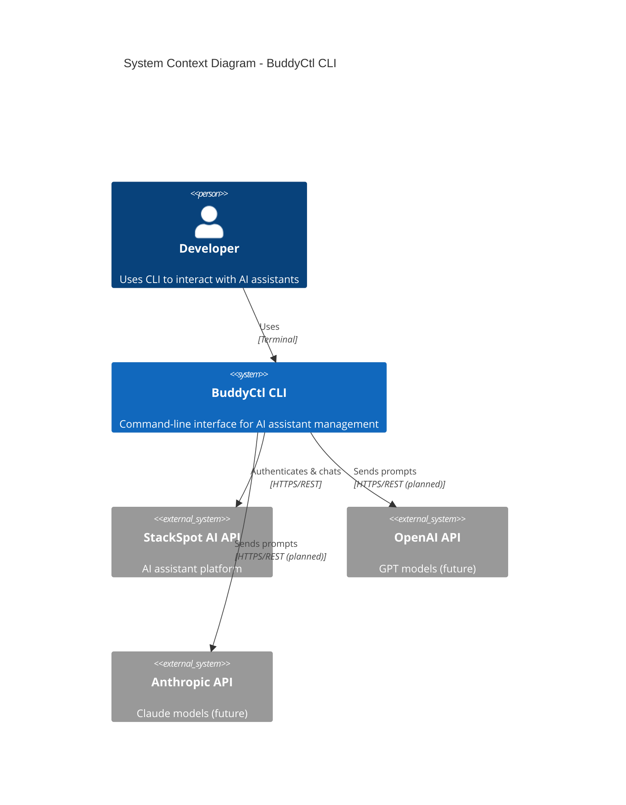
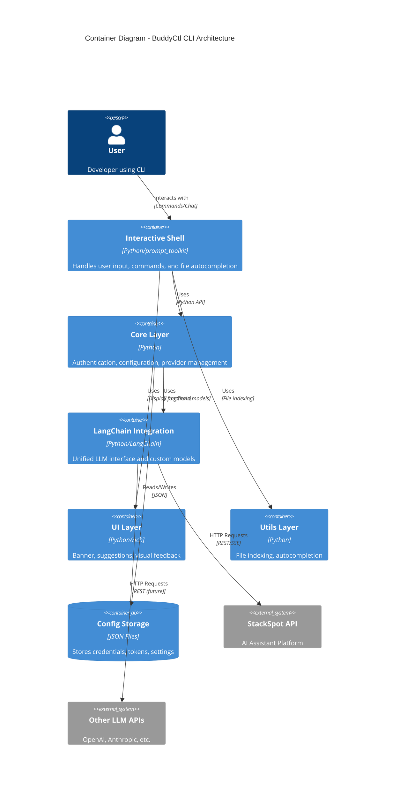
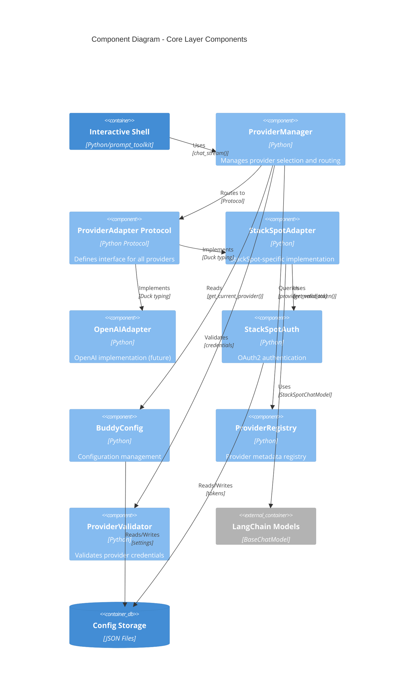
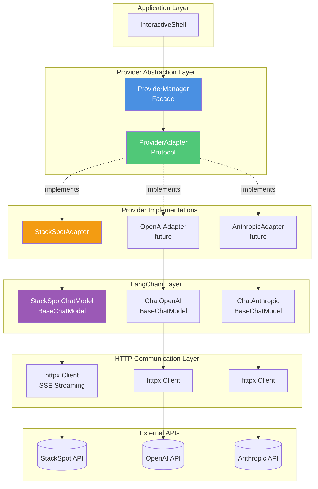
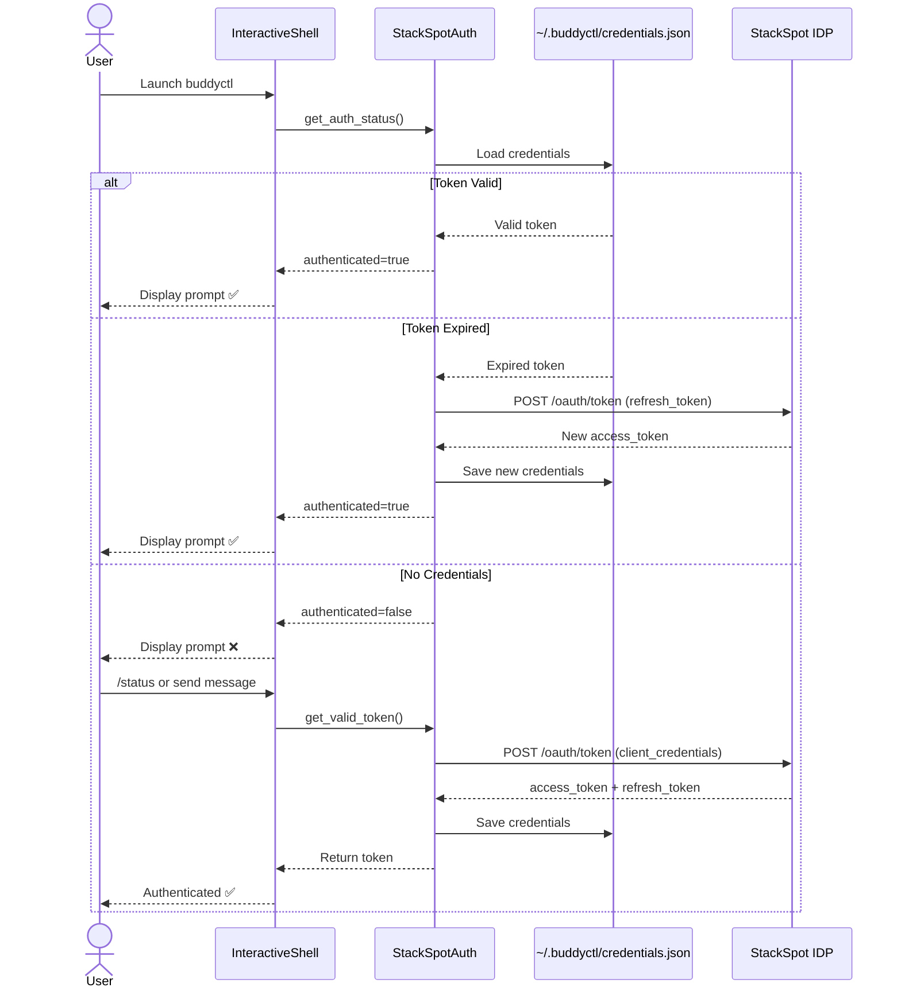
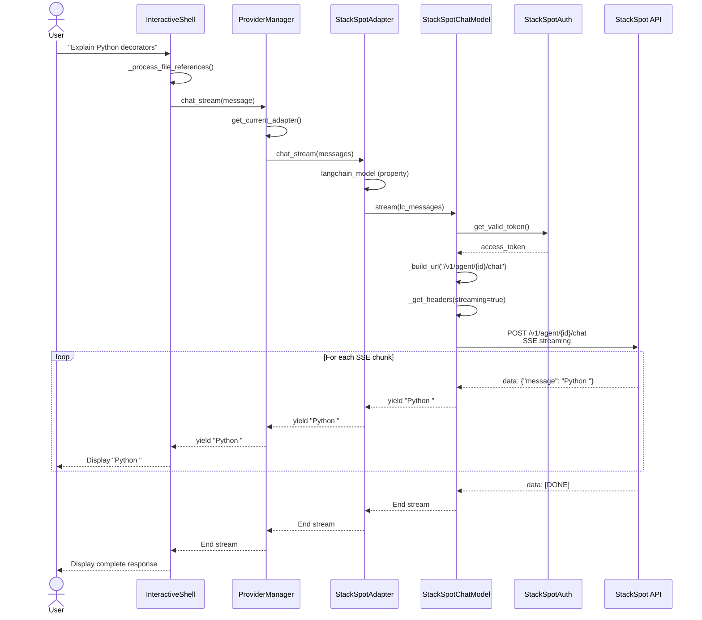
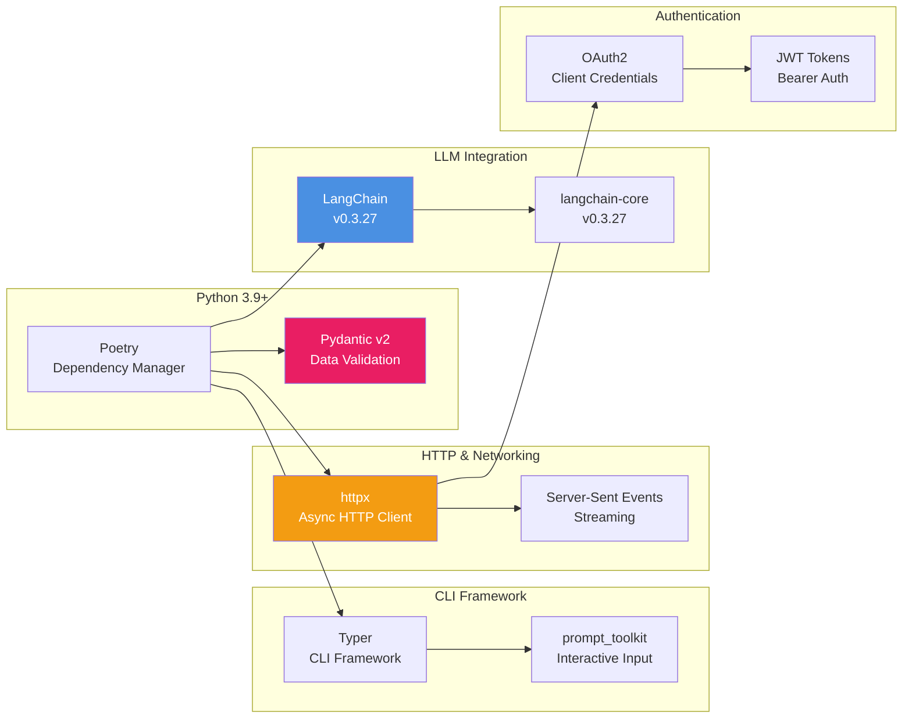

# BuddyCtl - Architecture Documentation

## Overview

BuddyCtl is a CLI tool for managing and interacting with StackSpot AI assistants (buddies). The application follows a layered architecture with clear separation of concerns, provider abstraction, and LangChain integration for multi-provider support.

## Table of Contents

- [System Context](#system-context)
- [Container Diagram](#container-diagram)
- [Component Diagram](#component-diagram)
- [Provider Architecture](#provider-architecture)
- [Authentication Flow](#authentication-flow)
- [Chat Flow](#chat-flow)
- [Technology Stack](#technology-stack)
- [Package Structure](#package-structure)

---

## System Context

The following diagram shows how BuddyCtl fits into the broader ecosystem:



**Key Interactions:**
- **Developer**: Uses the CLI to authenticate, configure agents, and chat with AI assistants
- **StackSpot API**: Current primary provider for AI chat completions
- **OpenAI/Anthropic**: Future providers for multi-LLM support

---

## Container Diagram

High-level view of the application containers and their interactions:



**Container Responsibilities:**
- **Interactive Shell**: User interaction, command parsing, chat orchestration
- **Core Layer**: Business logic, authentication, provider management
- **LangChain Integration**: LLM abstraction, custom chat models
- **UI Layer**: User interface components and visual feedback
- **Utils Layer**: Supporting utilities like file indexing

---

## Component Diagram

Detailed view of the Core Layer components:



**Component Responsibilities:**

| Component | Responsibility |
|-----------|---------------|
| **ProviderManager** | Central facade for provider operations, routes messages to correct adapter |
| **ProviderAdapter** | Protocol defining the interface all providers must implement |
| **StackSpotAdapter** | Concrete implementation for StackSpot AI using LangChain |
| **StackSpotAuth** | OAuth2 authentication with token refresh and persistence |
| **BuddyConfig** | Configuration management (agent IDs, provider selection) |
| **ProviderRegistry** | Metadata registry for all known providers |
| **ProviderValidator** | Validates provider credentials and availability |

---

## Provider Architecture

The provider abstraction layer enables multi-LLM support through a unified interface:



**Architecture Principles:**
1. **Single Responsibility**: Each adapter handles only one provider
2. **Open/Closed**: Add new providers without modifying existing code
3. **Dependency Inversion**: Application depends on Protocol, not concrete implementations
4. **Protocol-based Design**: Python Protocols enable structural subtyping (duck typing)
5. **LangChain Integration**: All providers use LangChain models for consistency

---

## Authentication Flow

OAuth2 authentication flow with token refresh:



**Token Lifecycle:**
- **Access Token**: Valid for ~1 hour, used for API requests
- **Refresh Token**: Used to obtain new access tokens without re-authenticating
- **Auto-Refresh**: Tokens automatically refreshed 60 seconds before expiration
- **Secure Storage**: Tokens stored in `~/.buddyctl/credentials.json` with `0600` permissions

---

## Chat Flow

End-to-end flow for sending a chat message:



**Key Steps:**
1. **File Reference Processing**: Shell checks for `@file` references and loads content
2. **Provider Routing**: ProviderManager selects appropriate adapter
3. **LangChain Abstraction**: Adapter converts to LangChain message format
4. **Authentication**: Model obtains valid token from Auth layer
5. **SSE Streaming**: HTTP request with Server-Sent Events for real-time response
6. **Chunk Processing**: Each chunk yielded through the entire stack to user

---

## Technology Stack

### Core Technologies



### Key Libraries

| Library | Version | Purpose |
|---------|---------|---------|
| **typer[all]** | ^0.9.0 | CLI framework with rich output |
| **httpx** | ^0.24.0 | Modern HTTP client with async support |
| **prompt-toolkit** | ^3.0.0 | Interactive input, autocompletion, history |
| **langchain** | ^0.3.27 | LLM abstraction and orchestration |
| **langchain-core** | ^0.3.27 | Core LangChain components |
| **pydantic** | ^2.0.0 | Data validation and settings management |

### Development Tools

| Tool | Purpose |
|------|---------|
| **pytest** | Testing framework |
| **black** | Code formatting |
| **ruff** | Fast Python linter |
| **mypy** | Static type checking |

---

## Package Structure

```
buddyctl-cli/
│
├── buddyctl/                          # Main package
│   ├── __init__.py
│   ├── __main__.py                    # Entry point for python -m buddyctl
│   ├── main.py                        # CLI entry point (Typer app)
│   │
│   ├── core/                          # Core business logic
│   │   ├── __init__.py
│   │   ├── auth.py                    # StackSpotAuth - OAuth2 authentication
│   │   ├── config.py                  # BuddyConfig - Configuration management
│   │   ├── api_client.py              # Legacy API client (deprecated)
│   │   ├── provider_registry.py       # Provider metadata registry
│   │   ├── provider_validator.py      # Provider credential validation
│   │   │
│   │   └── providers/                 # Provider abstraction layer
│   │       ├── __init__.py
│   │       ├── base.py                # ProviderAdapter Protocol + data models
│   │       ├── manager.py             # ProviderManager - Central facade
│   │       │
│   │       └── adapters/              # Provider implementations
│   │           ├── __init__.py
│   │           ├── stackspot.py       # StackSpotAdapter (implemented)
│   │           ├── openai.py          # OpenAIAdapter (future)
│   │           └── anthropic.py       # AnthropicAdapter (future)
│   │
│   ├── integrations/                  # External integrations
│   │   ├── __init__.py
│   │   │
│   │   └── langchain/                 # LangChain integration
│   │       ├── __init__.py
│   │       ├── chat_model.py          # StackSpotChatModel - Custom BaseChatModel
│   │       ├── utils.py               # Message conversion utilities
│   │       ├── chains.py              # LangChain chains (orchestration)
│   │       ├── tools.py               # LangChain tools
│   │       │
│   │       └── examples/              # Usage examples
│   │           ├── calculator.py      # Tool integration example
│   │           └── calculator_example.py
│   │
│   ├── cli/                           # CLI components
│   │   ├── __init__.py
│   │   ├── interactive.py             # InteractiveShell - Main shell
│   │   ├── agent_validator.py         # Agent ID validation
│   │   └── chat_client.py             # Legacy chat client (deprecated)
│   │
│   ├── ui/                            # User interface components
│   │   ├── __init__.py
│   │   ├── banner.py                  # ASCII banner display
│   │   ├── autosuggestion.py          # File autosuggestion logic
│   │   ├── enhanced_input.py          # Enhanced input handling
│   │   └── visual_suggestions.py      # Visual suggestion display
│   │
│   └── utils/                         # Utility modules
│       ├── __init__.py
│       ├── file_indexer.py            # File indexing system
│       └── file_autocomplete.py       # File autocompletion
│
├── tests/                             # Test suite
│   └── ...
│
├── .doc/                              # Feature documentation
│   ├── feature-template.md
│   ├── fix-template.md
│   ├── feature-12-use-stackspot-adapter.md
│   └── ...
│
├── pyproject.toml                     # Poetry configuration
├── poetry.lock                        # Dependency lock file
├── .env.example                       # Environment variables template
├── README.md                          # User documentation
└── ARCHITECTURE.md                    # This file
```

### Package Responsibilities

#### `buddyctl/core/`
- **Authentication**: OAuth2 flow, token management, credential storage
- **Configuration**: Agent IDs, provider selection, settings persistence
- **Provider Management**: Adapter selection, routing, validation

#### `buddyctl/core/providers/`
- **base.py**: Defines `ProviderAdapter` Protocol and data models (`ChatMessage`, `ChatResponse`)
- **manager.py**: `ProviderManager` - Central facade for provider operations
- **adapters/**: Concrete provider implementations following the Protocol

#### `buddyctl/integrations/langchain/`
- **chat_model.py**: Custom `StackSpotChatModel` extending LangChain's `BaseChatModel`
- **utils.py**: Message format conversion (LangChain ↔ StackSpot)
- **chains.py**: LangChain chains for complex workflows
- **tools.py**: Custom tools for agent integration

#### `buddyctl/cli/`
- **interactive.py**: Main interactive shell with command parsing and chat orchestration
- **agent_validator.py**: Validates agent IDs and availability

#### `buddyctl/ui/`
- **banner.py**: Displays status banner with auth/agent info
- **autosuggestion.py**: Handles file reference suggestions (`@file` syntax)
- **enhanced_input.py**: Enhanced input with history and completion
- **visual_suggestions.py**: Visual display of file suggestions

#### `buddyctl/utils/`
- **file_indexer.py**: Indexes project files for autocompletion
- **file_autocomplete.py**: Provides file completion in chat input

---

## Design Patterns

### 1. **Facade Pattern**
- **ProviderManager** acts as a simplified interface to the provider subsystem
- Hides complexity of adapter selection and message routing

### 2. **Protocol Pattern (Structural Subtyping)**
- **ProviderAdapter** defines interface without inheritance
- Enables duck typing with runtime validation via `@runtime_checkable`

### 3. **Adapter Pattern**
- **StackSpotAdapter** adapts StackSpot API to unified `ProviderAdapter` interface
- Future adapters (OpenAI, Anthropic) follow same pattern

### 4. **Strategy Pattern**
- Providers are interchangeable strategies for chat completion
- Selected dynamically based on configuration

### 5. **Factory Pattern**
- **ProviderManager** constructs appropriate adapter based on provider name
- Encapsulates adapter instantiation logic

---

## Configuration Files

### `~/.buddyctl/credentials.json`
```json
{
  "access_token": "eyJhbGci...",
  "refresh_token": "refresh_token_here",
  "expires_at": 1234567890,
  "realm": "your-realm",
  "token_type": "Bearer"
}
```
- **Permissions**: `0600` (owner read/write only)
- **Auto-managed**: Created and updated by `StackSpotAuth`

### `~/.buddyctl/config.json`
```json
{
  "default_agent_id": "01K48SKQWX4D7A3AYF0P02X6GJ",
  "current_provider": "stackspot"
}
```
- **Managed by**: `BuddyConfig`
- **Stores**: User preferences and settings

### `.env`
```bash
STACKSPOT_CLIENT_ID=your_client_id
STACKSPOT_CLIENT_SECRET=your_client_secret
STACKSPOT_REALM=your_realm
STACKSPOT_AUTH_URL=https://idm.stackspot.com
STACKSPOT_API_URL=https://genai-inference-app.stackspot.com
```
- **Required for**: StackSpot authentication
- **Loaded by**: `StackSpotAuth` and `StackSpotChatModel`

---

## Future Enhancements

### Planned Features
1. **Multi-Provider Support**
   - OpenAI (ChatGPT) integration
   - Anthropic (Claude) integration
   - Google (Gemini) integration
   - Ollama (local models) integration

2. **Advanced LangChain Features**
   - Agent chains with tools
   - Memory and conversation history
   - RAG (Retrieval-Augmented Generation)
   - Multi-agent orchestration

3. **Enhanced CLI Features**
   - Plugin system for custom commands
   - Configuration profiles
   - Batch processing mode
   - Export chat history

4. **Performance Optimizations**
   - Connection pooling
   - Request caching
   - Async I/O for multiple providers

---

## References

### Related Documentation
- [Feature 12: Unified Architecture Migration](.doc/feature-12-use-stackspot-adapter.md)
- [Feature 11: Provider Abstraction Layer](.doc/feature-11-provider-abstraction.md)
- [Feature 7: LangChain Wrapper](.doc/feature-7-langchain-wrapper.md)

### External Resources
- [LangChain Documentation](https://python.langchain.com/)
- [Typer Documentation](https://typer.tiangolo.com/)
- [httpx Documentation](https://www.python-httpx.org/)
- [Python Protocols (PEP 544)](https://peps.python.org/pep-0544/)
- [C4 Model](https://c4model.com/)

---

**Document Version**: 1.0
**Last Updated**: 2025-10-16
**Author**: Architecture Team
**Status**: Current
