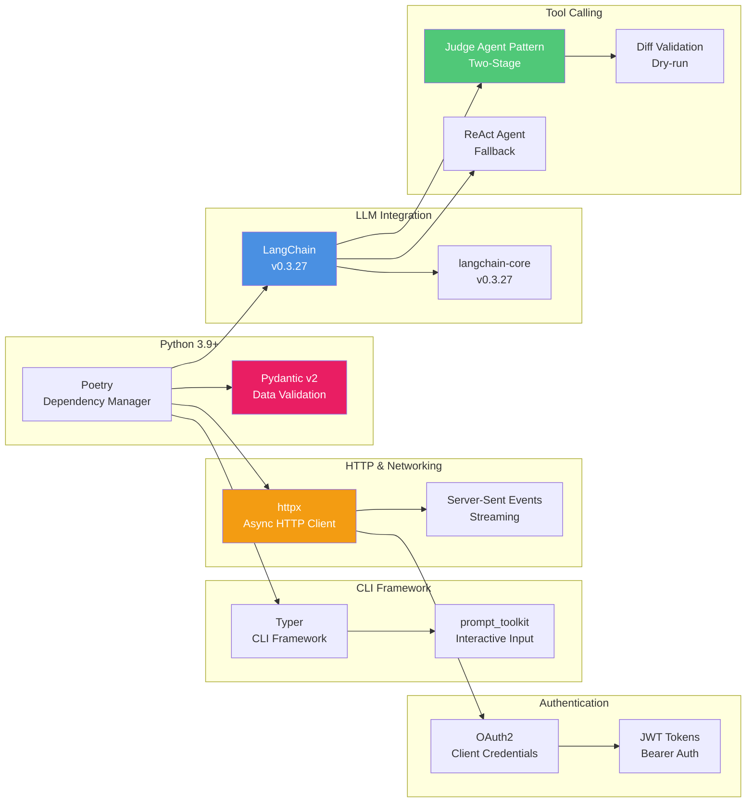
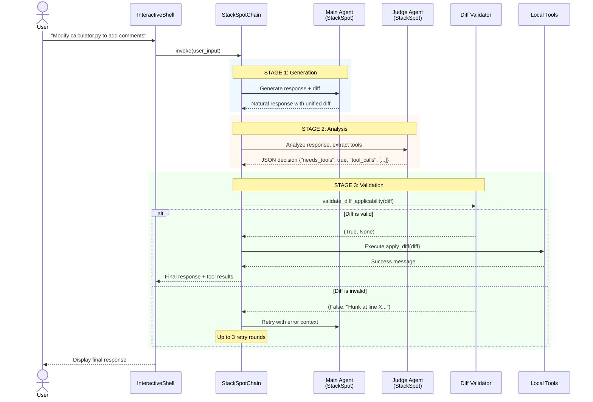

# BuddyCtl - Architecture Documentation

## Overview

BuddyCtl is a CLI tool for managing and interacting with StackSpot AI assistants (buddies). The application follows a layered architecture with clear separation of concerns, provider abstraction, and LangChain integration for multi-provider support.

## Table of Contents

- [System Context](#system-context)
- [Container Diagram](#container-diagram)
- [Component Diagram](#component-diagram)
- [Provider Architecture](#provider-architecture)
- [Authentication Flow](#authentication-flow)
- [Chat Flow](#chat-flow)
- [Technology Stack](#technology-stack)
- [Package Structure](#package-structure)

---

## System Context

The following diagram shows how BuddyCtl fits into the broader ecosystem:


**Key Interactions:**
- **Developer**: Uses the CLI to authenticate, configure agents, and chat with AI assistants
- **StackSpot API**: Current primary provider for AI chat completions
- **OpenAI/Anthropic**: Future providers for multi-LLM support

---

## Container Diagram

High-level view of the application containers and their interactions:


**Container Responsibilities:**
- **Interactive Shell**: User interaction, command parsing, chat orchestration
- **Core Layer**: Business logic, authentication, provider management
- **LangChain Integration**: LLM abstraction, custom chat models
- **UI Layer**: User interface components and visual feedback
- **Utils Layer**: Supporting utilities like file indexing

---

## Component Diagram

Detailed view of the Core Layer components:


**Component Responsibilities:**

| Component | Responsibility |
|-----------|---------------|
| **ProviderManager** | Central facade for provider operations, routes messages to correct adapter |
| **ProviderAdapter** | Protocol defining the interface all providers must implement |
| **StackSpotAdapter** | Concrete implementation for StackSpot AI using LangChain |
| **StackSpotAuth** | OAuth2 authentication with token refresh and persistence |
| **BuddyConfig** | Configuration management (agent IDs, provider selection) |
| **ProviderRegistry** | Metadata registry for all known providers |
| **ProviderValidator** | Validates provider credentials and availability |

---

## Provider Architecture

The provider abstraction layer enables multi-LLM support through a unified interface:


**Architecture Principles:**
1. **Single Responsibility**: Each adapter handles only one provider
2. **Open/Closed**: Add new providers without modifying existing code
3. **Dependency Inversion**: Application depends on Protocol, not concrete implementations
4. **Protocol-based Design**: Python Protocols enable structural subtyping (duck typing)
5. **LangChain Integration**: All providers use LangChain models for consistency

---

## Authentication Flow

OAuth2 authentication flow with token refresh:


**Token Lifecycle:**
- **Access Token**: Valid for ~1 hour, used for API requests
- **Refresh Token**: Used to obtain new access tokens without re-authenticating
- **Auto-Refresh**: Tokens automatically refreshed 60 seconds before expiration
- **Secure Storage**: Tokens stored in `~/.buddyctl/credentials.json` with `0600` permissions

---

## Chat Flow

End-to-end flow for sending a chat message:


**Key Steps:**
1. **File Reference Processing**: Shell checks for `@file` references and loads content
2. **Provider Routing**: ProviderManager selects appropriate adapter
3. **LangChain Abstraction**: Adapter converts to LangChain message format
4. **Authentication**: Model obtains valid token from Auth layer
5. **SSE Streaming**: HTTP request with Server-Sent Events for real-time response
6. **Chunk Processing**: Each chunk yielded through the entire stack to user

---

## Technology Stack

### Core Technologies



### Key Libraries

| Library | Version | Purpose |
|---------|---------|---------|
| **typer[all]** | ^0.9.0 | CLI framework with rich output |
| **httpx** | ^0.24.0 | Modern HTTP client with async support |
| **prompt-toolkit** | ^3.0.0 | Interactive input, autocompletion, history |
| **langchain** | ^0.3.27 | LLM abstraction and orchestration |
| **langchain-core** | ^0.3.27 | Core LangChain components |
| **pydantic** | ^2.0.0 | Data validation and settings management |

### Development Tools

| Tool | Purpose |
|------|---------|
| **pytest** | Testing framework |
| **black** | Code formatting |
| **ruff** | Fast Python linter |
| **mypy** | Static type checking |

---

## Package Structure

```
buddyctl-cli/
│
├── buddyctl/                          # Main package
│   ├── __init__.py
│   ├── __main__.py                    # Entry point for python -m buddyctl
│   ├── main.py                        # CLI entry point (Typer app)
│   │
│   ├── core/                          # Core business logic
│   │   ├── __init__.py
│   │   ├── auth.py                    # StackSpotAuth - OAuth2 authentication
│   │   ├── config.py                  # BuddyConfig - Configuration management
│   │   ├── api_client.py              # Legacy API client (deprecated)
│   │   ├── provider_registry.py       # Provider metadata registry
│   │   ├── provider_validator.py      # Provider credential validation
│   │   │
│   │   └── providers/                 # Provider abstraction layer
│   │       ├── __init__.py
│   │       ├── base.py                # ProviderAdapter Protocol + data models
│   │       ├── manager.py             # ProviderManager - Central facade
│   │       │
│   │       └── adapters/              # Provider implementations
│   │           ├── __init__.py
│   │           ├── stackspot.py       # StackSpotAdapter (implemented)
│   │           ├── openai.py          # OpenAIAdapter (planned)
│   │           └── anthropic.py       # AnthropicAdapter (planned)
│   │
│   ├── integrations/                  # External integrations
│   │   ├── __init__.py
│   │   │
│   │   └── langchain/                 # LangChain integration
│   │       ├── __init__.py
│   │       ├── chat_model.py          # StackSpotChatModel - Custom BaseChatModel
│   │       ├── utils.py               # Message conversion utilities
│   │       ├── tools.py               # LangChain tools (read_file, apply_diff)
│   │       ├── agents.py              # ReAct Agent integration
│   │       ├── context_formatter.py   # Context formatting for prompts
│   │       │
│   │       ├── chains/                # Chain implementations
│   │       │   ├── __init__.py
│   │       │   ├── base.py            # BaseChain abstract class
│   │       │   ├── stackspot_chain.py # StackSpotChain (Judge Agent pattern)
│   │       │   └── legacy.py          # Legacy chain implementations
│   │       │
│   │       └── examples/              # Usage examples
│   │           ├── calculator.py      # Tool integration example
│   │           └── calculator_example.py
│   │
│   ├── cli/                           # CLI components
│   │   ├── __init__.py
│   │   ├── interactive.py             # InteractiveShell - Main shell
│   │   ├── agent_validator.py         # Agent ID validation
│   │   └── chat_client.py             # Legacy chat client (deprecated)
│   │
│   ├── ui/                            # User interface components
│   │   ├── __init__.py
│   │   ├── banner.py                  # ASCII banner display
│   │   ├── autosuggestion.py          # File autosuggestion logic
│   │   ├── enhanced_input.py          # Enhanced input handling
│   │   └── visual_suggestions.py      # Visual suggestion display
│   │
│   └── utils/                         # Utility modules
│       ├── __init__.py
│       ├── file_indexer.py            # File indexing system
│       └── file_autocomplete.py       # File autocompletion
│
├── tests/                             # Test suite
│   └── ...
│
├── prompts/                           # Agent prompts (Two-Stage Pattern)
│   ├── README.md                      # Prompts documentation
│   ├── main_agent.md                  # Main Agent system prompt
│   └── judge_agent.md                 # Judge Agent system prompt
│
├── .doc/                              # Feature documentation
│   ├── feature-template.md
│   ├── fix-template.md
│   ├── FEATURES_ROADMAP.md
│   ├── feature-17-unified-tool-calling-abstraction.md
│   ├── feature-18-judge-agent-integration.md
│   └── ...
│
├── pyproject.toml                     # Poetry configuration
├── poetry.lock                        # Dependency lock file
├── .env.example                       # Environment variables template
├── README.md                          # User documentation
└── ARCHITECTURE.md                    # This file
```

### Package Responsibilities

#### `buddyctl/core/`
- **Authentication**: OAuth2 flow, token management, credential storage
- **Configuration**: Agent IDs, provider selection, settings persistence
- **Provider Management**: Adapter selection, routing, validation

#### `buddyctl/core/providers/`
- **base.py**: Defines `ProviderAdapter` Protocol and data models (`ChatMessage`, `ChatResponse`)
- **manager.py**: `ProviderManager` - Central facade for provider operations
- **adapters/**: Concrete provider implementations following the Protocol

#### `buddyctl/integrations/langchain/`
- **chat_model.py**: Custom `StackSpotChatModel` extending LangChain's `BaseChatModel`
- **utils.py**: Message format conversion (LangChain ↔ StackSpot)
- **tools.py**: LangChain tools (`read_file`, `apply_diff`) with diff validation
- **agents.py**: ReAct Agent creation with streaming control
- **context_formatter.py**: Context formatting utilities for prompts
- **chains/**: Chain implementations for different orchestration patterns
  - **base.py**: Abstract base class for all chains
  - **stackspot_chain.py**: Judge Agent pattern (two-stage tool calling)
  - **legacy.py**: Legacy chain implementations

#### `buddyctl/cli/`
- **interactive.py**: Main interactive shell with command parsing and chat orchestration
- **agent_validator.py**: Validates agent IDs and availability

#### `buddyctl/ui/`
- **banner.py**: Displays status banner with auth/agent info
- **autosuggestion.py**: Handles file reference suggestions (`@file` syntax)
- **enhanced_input.py**: Enhanced input with history and completion
- **visual_suggestions.py**: Visual display of file suggestions

#### `buddyctl/utils/`
- **file_indexer.py**: Indexes project files for autocompletion
- **file_autocomplete.py**: Provides file completion in chat input

---

## Design Patterns

### 1. **Facade Pattern**
- **ProviderManager** acts as a simplified interface to the provider subsystem
- Hides complexity of adapter selection and message routing

### 2. **Protocol Pattern (Structural Subtyping)**
- **ProviderAdapter** defines interface without inheritance
- Enables duck typing with runtime validation via `@runtime_checkable`

### 3. **Adapter Pattern**
- **StackSpotAdapter** adapts StackSpot API to unified `ProviderAdapter` interface
- Future adapters (OpenAI, Anthropic) follow same pattern

### 4. **Strategy Pattern**
- Providers are interchangeable strategies for chat completion
- Selected dynamically based on configuration

### 5. **Factory Pattern**
- **ProviderManager** constructs appropriate adapter based on provider name
- Encapsulates adapter instantiation logic

---

## Configuration Files

### `~/.buddyctl/credentials.json`
```json
{
  "access_token": "eyJhbGci...",
  "refresh_token": "refresh_token_here",
  "expires_at": 1234567890,
  "realm": "your-realm",
  "token_type": "Bearer"
}
```
- **Permissions**: `0600` (owner read/write only)
- **Auto-managed**: Created and updated by `StackSpotAuth`

### `~/.buddyctl/config.json`
```json
{
  "default_agent_id": "01K48SKQWX4D7A3AYF0P02X6GJ",
  "judge_agent_id": "01K48SKQWX4D7A3AYF0P02X6GK",
  "agent_mode": true,
  "llm": {
    "current_provider": "stackspot"
  },
  "updated_at": "2025-10-20T12:00:00Z"
}
```
- **Managed by**: `BuddyConfig`
- **Stores**: User preferences and agent IDs
- **Note**: Config is automatically managed, users don't need to edit manually

### `.env`
```bash
# Required: Authentication
STACKSPOT_CLIENT_ID=your_client_id
STACKSPOT_CLIENT_SECRET=your_client_secret
STACKSPOT_REALM=your_realm

# Required: API URLs
STACKSPOT_AUTH_URL=https://idm.stackspot.com
STACKSPOT_API_URL=https://genai-inference-app.stackspot.com

# Required: Agent IDs
STACKSPOT_CODER_ID=your_main_agent_id
STACKSPOT_JUDGE_AGENT_ID=your_judge_agent_id
```
- **All variables are required**
- **Loaded by**: `StackSpotAuth`, `StackSpotChatModel`, and `BuddyConfig`

---

## Judge Agent Pattern (Two-Stage Tool Calling)

BuddyCtl implements an innovative two-stage pattern for tool calling that works with LLMs that don't have native function calling support (like StackSpot):

### Architecture Overview



### Key Components

#### 1. StackSpotChain (Orchestrator)
Located at: `buddyctl/integrations/langchain/chains/stackspot_chain.py`

**Responsibilities:**
- Orchestrate the two-stage flow
- Handle retry logic (up to 3 rounds)
- Format correction prompts with context
- Validate diffs before execution

**Flow:**
```python
def invoke(user_input: str) -> Dict[str, Any]:
    # Round 1: Initial attempt
    main_response = main_model.invoke(user_input)
    decision = judge_model.analyze(main_response)

    if decision["needs_tools"]:
        diff = extract_diff(decision["tool_calls"])
        is_valid, error = validate_diff_applicability(diff)

        if not is_valid:
            # Round 2-3: Retry with error feedback
            main_response = main_model.invoke(correction_prompt(error))
            # ... repeat validation ...
```

#### 2. Main Agent
**Purpose:** Generate natural, complete responses with embedded diffs

**System Prompt:** Located at `prompts/main_agent.md`

**Characteristics:**
- Conversational tone
- Can speculate using clear language
- Generates complete unified diffs
- No need to follow rigid Action:/Input: format
- Focuses on helpful response, not tool execution

**Example Output:**
```
I'll add type hints to your functions. Here's the diff:

--- a/calculator.py
+++ b/calculator.py
@@ -1,3 +1,3 @@
-def add(a, b):
+def add(a: float, b: float) -> float:
     return a + b
```

#### 3. Judge Agent
**Purpose:** Analyze Main Agent response and decide if tools should execute

**System Prompt:** Located at `prompts/judge_agent.md`

**Characteristics:**
- Analytical tone
- Pattern-based detection (keywords, markers)
- Always returns valid JSON
- Analyzes CONTENT, not quality
- Extracts complete diffs from response

**Decision Framework:**
```python
# Speculation Detection
if "probably" in response or "without seeing" in response:
    return {"needs_tools": true, "tool_calls": [{"name": "read_file", ...}]}

# Diff Detection
if "---" in response and "+++" in response and "@@" in response:
    diff = extract_diff(response)
    return {"needs_tools": true, "tool_calls": [{"name": "apply_diff", "args": {"diff_content": diff}}]}

# Complete Response
else:
    return {"needs_tools": false, "tool_calls": []}
```

#### 4. Diff Validator
Located at: `buddyctl/integrations/langchain/tools.py:validate_diff_applicability()`

**Purpose:** Dry-run validation before applying diffs

**Process:**
1. Parse unified diff structure
2. Read target file
3. Try to match hunks using fuzzy search (±5 lines)
4. Return (is_valid, error_message)

**Benefits:**
- Prevents partial/corrupted applications
- Provides specific error messages for correction
- Enables retry logic with context

#### 5. Retry Mechanism
When diff validation fails:

**Round 1:** Initial attempt
```
User: "Add comments to calculator.py"
Main Agent: [generates diff with wrong line numbers]
Validator: ❌ "Hunk at line 34 does not match file content"
```

**Round 2:** Correction with context
```
Correction Prompt:
"ROUND 2 - DIFF CORRECTION REQUIRED

Your previous diff failed with:
ERROR: Hunk at line 34 does not match file content

Current file content with line numbers:
1 | def add(a, b):
2 |     return a + b
3 |
4 | def subtract(a, b):
...

Please generate a CORRECTED diff using the exact line numbers shown above."

Main Agent: [generates corrected diff]
Validator: ✅ Valid
```

**Up to 3 rounds** before giving up

### Configuration

**Environment Variables (All Required):**
```bash
STACKSPOT_CLIENT_ID=your_client_id
STACKSPOT_CLIENT_SECRET=your_client_secret
STACKSPOT_REALM=your_realm
STACKSPOT_AUTH_URL=https://idm.stackspot.com
STACKSPOT_API_URL=https://genai-inference-app.stackspot.com
STACKSPOT_CODER_ID=your_main_agent_id
STACKSPOT_JUDGE_AGENT_ID=your_judge_agent_id
```

**Config File:**
```json
{
  "default_agent_id": "main_agent_id",
  "judge_agent_id": "judge_agent_id",
  "agent_mode": true
}
```

### Performance Metrics

| Metric | Judge Pattern | ReAct Pattern |
|--------|---------------|---------------|
| Success Rate | ~80-90% | ~60-70% |
| LLM Calls | 2-3 | 3-5 |
| Output Quality | Clean, natural | Verbose, explicit |
| Retry Capability | ✅ Yes (3 rounds) | ❌ No |
| Validation | ✅ Dry-run | ❌ Apply directly |

---

## Implemented Features (Current State)

### Tool Calling System (Feature 17-18) ✅
**Two-Stage Pattern with Judge Agent:**
- **StackSpotChain**: Orchestrates Main Agent → Judge Agent → Tool Execution
- **Diff Validation**: Dry-run validation before applying changes (`validate_diff_applicability`)
- **Retry Logic**: Automatic correction rounds (up to 3 attempts) when diffs fail
- **Context Formatting**: Rich context with line numbers for better agent understanding

**Architecture:**
```
User Request → Main Agent (generates response + diff)
             ↓
        Judge Agent (analyzes response, decides tools)
             ↓
        Diff Validator (dry-run check)
             ↓
        Tool Execution (apply if valid, or retry)
```

### Tool Calling Strategies ✅
1. **Judge Pattern** (Primary for StackSpot):
   - Main Agent generates natural response with diff
   - Judge Agent analyzes and extracts tool calls
   - Validation before execution
   - ~80-90% success rate, clean output

2. **ReAct Pattern** (Fallback):
   - Traditional LangChain ReAct Agent
   - Explicit reasoning steps
   - ~60-70% success rate, verbose output
   - Falls back when Judge Agent not configured

### Provider Abstraction (Feature 11-12) ✅
- **Protocol-based Design**: `ProviderAdapter` using Python Protocol
- **StackSpotAdapter**: Fully implemented with Judge Agent integration
- **OpenAI/Anthropic Adapters**: Skeleton created, not yet implemented
- **Unified Interface**: `get_model_with_tools(tools, strategy="auto")`

### Configuration System ✅
- **All environment variables are required**: No optional configuration
- **judge_agent_id**: ID for Judge Agent (two-stage pattern)
- **agent_mode**: Internally managed (always enabled)

### Tools ✅
- **read_file**: Read file content with error handling
- **apply_diff**: Apply unified diff with validation
  - Fuzzy matching (±5 lines search window)
  - Multi-hunk support
  - Path traversal protection
  - UTF-8 validation

---

## Future Enhancements

### Planned Features (Not Yet Implemented)
1. **Multi-Provider Support** ⏳
   - OpenAI (ChatGPT) integration - skeleton created
   - Anthropic (Claude) integration - skeleton created
   - Google (Gemini) integration - planned
   - Ollama (local models) integration - planned

2. **Advanced LangChain Features** ⏳
   - Memory and conversation history
   - RAG (Retrieval-Augmented Generation)
   - Multi-agent orchestration
   - Custom prompt templates

3. **Enhanced CLI Features** ⏳
   - Plugin system for custom commands
   - Configuration profiles
   - Batch processing mode
   - Export chat history

4. **Performance Optimizations** ⏳
   - Connection pooling
   - Request caching
   - Async I/O for multiple providers

---

## References

### External Resources
- [LangChain Documentation](https://python.langchain.com/)
- [Typer Documentation](https://typer.tiangolo.com/)
- [httpx Documentation](https://www.python-httpx.org/)
- [Python Protocols (PEP 544)](https://peps.python.org/pep-0544/)
- [C4 Model](https://c4model.com/)

---

**Document Version**: 2.0
**Last Updated**: 2025-10-20
**Author**: Architecture Team
**Status**: Current

## Changelog

### Version 2.0 (2025-10-20)
**Major Updates:**
- ✅ Added Two-Stage Tool Calling (Judge Agent pattern) documentation
- ✅ Updated package structure with chains/ subdirectory
- ✅ Added prompts/ directory for agent prompts
- ✅ Documented diff validation system with retry logic
- ✅ Added tool calling strategies (Judge vs ReAct patterns)
- ✅ Updated configuration schema with judge_agent_id and tool_calling_strategy
- ✅ Documented context_formatter.py for prompt formatting
- ✅ Added comprehensive tools documentation (read_file, apply_diff with validation)
- ✅ Updated technology stack diagram with Tool Calling subsystem
- ✅ Separated "Implemented Features" from "Future Enhancements"
- ✅ Added references to Feature 17 and Feature 18 documentation
- ✅ Updated provider adapter architecture with ExecutorProtocol

### Version 1.0 (2025-10-16)
- Initial architecture documentation
- Provider abstraction layer design
- LangChain integration architecture
- System context and component diagrams
